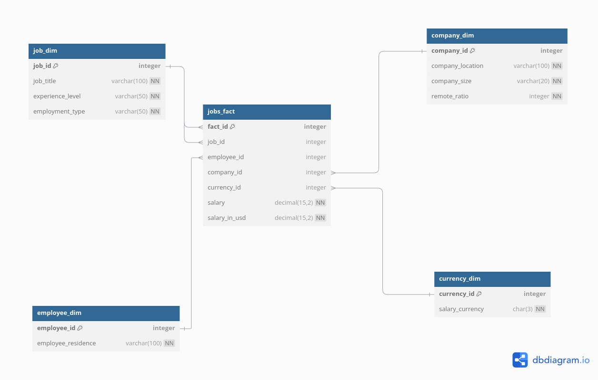

# ETL Project: Multi-Source Data Integration and Analysis

## Table of Contents
1. [Project Overview](#project-overview)
2. [Architecture](#architecture)
3. [Technologies Used](#technologies-used)
4. [Data Sources](#data-sources)
5. [ETL Process](#etl-process)
   1. [Extraction](#extraction)
   2. [Transformation](#transformation)
   3. [Loading](#loading)
6. [Database Systems](#database-systems)
   1. [PostgreSQL (Staging)](#postgresql-staging)
   2. [MariaDB (OLAP)](#mariadb-olap)
7. [Optimization Techniques](#optimization-techniques)
8. [Setup and Installation](#setup-and-installation)
9. [Usage](#usage)
10. [Contributing](#contributing)
11. [License](#license)

## Project Overview
This project integrates data from multiple sources to provide meaningful insights. The ETL (Extract, Transform, Load) pipeline processes data from various formats, cleans and merges it, and stores it in optimized database systems for analytical purposes.

## Architecture
The project leverages Docker to containerize the tools used, ensuring portability and scalability across different environments. Containerization provides a consistent setup, making deployment and management easier.

## Technologies Used
- Docker
- PySpark
- Python (Web scraping)
- PostgreSQL (Staging Database)
- MariaDB (OLAP Database)
- Pandas
- Apache Airflow (Orchestration)
- Power BI (Dashboard)

## Data Sources
The data is collected from multiple sources in various formats:
- JSON
- CSV
- Parquet
- Web scraping (custom Python scripts)

## ETL Process

### Extraction
We use PySpark for data extraction due to its advantages:
1. **Distributed Processing**: PySpark’s distributed computing efficiently handles large datasets.
2. **In-memory Computing**: Faster data operations compared to disk-based processing.
3. **Unified API**: Simplifies the extraction from multiple sources.
4. **Scalability**: Scales seamlessly with the growth of data.
5. **Rich Ecosystem**: Easily integrates with other big data tools.

### Transformation
After extraction, data goes through the following steps:
1. Cleaning and processing with PySpark.
2. Merging data into a unified DataFrame.
3. Schema validation and inference to ensure consistency.

### Loading
We utilize two databases:

1. **PostgreSQL (Staging Database)**:
   - Used as a staging area for initial data loads.
   - Pandas helps in moving data into this staging area.
   - A timestamp column tracks data loading times.
   - An archive table stores historical data.

2. **MariaDB (OLAP Database)**:
   - Optimized for analytical workloads using columnar storage.
   - Columnar storage improves query performance and compression.
   - Parallel processing allows efficient column-wise data retrieval.

## Database Systems

### PostgreSQL (Staging)
- Handles heavy write operations.
- Supports schema management and overwriting.
- Archiving mechanism for tracking old data.

### MariaDB (OLAP)
- Optimized for read-heavy, analytical queries.
- Uses columnar storage to enhance query performance and compression.

## Optimization Techniques
- **PostgreSQL**: Increased buffer pool size for handling heavy write operations.
- **MariaDB**: Utilized columnar storage for fast analytical query performance.

## Setup and Installation
### Prerequisites
- Docker and Docker Compose installed.

### Steps:
1. Create a `docker-compose.yaml` file to define the services (Airflow, MariaDB, PostgreSQL, etc.).
2. Create a Dockerfile for each container with the necessary packages.
    Example Dockerfile for Airflow:
    ```dockerfile
    FROM apache/airflow:2.7.1
    USER root

    COPY requirements.txt /requirements.txt

    RUN apt-get update && \
        apt-get install -y --no-install-recommends \
            gcc \
            python3-dev \
            default-jdk \
            procps \
            libpq-dev \
            curl && \
        apt-get clean && \
        rm -rf /var/lib/apt/lists/*

    ENV JAVA_HOME /usr/lib/jvm/java-11-openjdk-amd64/
    ENV PATH $JAVA_HOME/bin:$PATH

    RUN mkdir -p /opt/spark/jars && \
        chmod -R 777 /opt/spark/jars

    RUN curl -L https://jdbc.postgresql.org/download/postgresql-42.6.0.jar -o /tmp/postgresql-42.6.0.jar && \
        mv /tmp/postgresql-42.6.0.jar /opt/spark/jars/

    RUN curl -L https://dlm.mariadb.com/3852266/Connectors/java/connector-java-3.4.1/mariadb-java-client-3.4.1.jar -o /tmp/mariadb-java-client-3.4.1.jar && \
        mv /tmp/mariadb-java-client-3.4.1.jar /opt/spark/jars/

    USER airflow

    RUN pip install --upgrade pip
    RUN pip install --no-cache-dir -r /requirements.txt
    ```

3. Build and start the containers:
    ```bash
    docker-compose up --build
    ```

4. Verify the containers are running:
    ```bash
    docker ps
    ```

## Usage
### Running the ETL Process:
1. Data extraction from multiple formats (JSON, CSV, Parquet) using PySpark.
2. Transformation and data cleaning.
3. Loading into PostgreSQL (staging) and MariaDB (OLAP).

### Example Function:
```python
def extract_data():
    from pyspark.sql import SparkSession

    schema = ...  # Define schema here
    spark = SparkSession.builder.appName('extractor').getOrCreate()

    # Read CSV files into PySpark DataFrames
    data1 = spark.read.csv('/path/to/data1.csv', header=True, schema=schema)
    data2 = spark.read.csv('/path/to/data2.csv', header=True, inferSchema=True)
    ...
    
    # Union the datasets
    merged_dataset = data1.union(data2).union(data3)
    
    # Save as CSV
    merged_dataset.toPandas().to_csv('/path/to/output.csv', index=False)

```
## Creating PostgreSQL staging database
```sql
   CREATE TABLE staging_data (...);
   ALTER TABLE staging_data ...;
   CREATE TABLE arcived_data (...);
   CREATE PROCEDURE load_data(...);
```
## Creating mariadb star model

 ```sql 
   SET GLOBAL sql_mode = 'ANSI';
```
## Apache Airflow DAGs
# To integrate the ETL pipeline, add the DAG file to the dags directory and ensure the volumes are mounted correctly:
```yaml
   volumes:
    - ${AIRFLOW_PROJ_DIR:-.}/dags:/opt/airflow/dags
    - ${AIRFLOW_PROJ_DIR:-.}/logs:/opt/airflow/logs
    - ${AIRFLOW_PROJ_DIR:-.}/config:/opt/airflow/config
    - ${AIRFLOW_PROJ_DIR:-.}/plugins:/opt/airflow/plugins
    - ${AIRFLOW_PROJ_DIR:-.}/data:/opt/airflow/data
    - ${AIRFLOW_PROJ_DIR:-.}/scripts:/opt/airflow/scripts
    - /home/meqlad/airflow_customers_data_pipeline/data:/home/meqlad/airflow_customers_data_pipeline/data
```
## Access the container to verify volume mounts:
```bash
   docker exec -it -u 0 etl_grad_project-airflow-webserver-1 bash
   ls -l 
```
## Add the main file in the dags directory for our main DAG and ensure the root path is appended in the container:
```python
   sys.path.append('/opt/ariflow/scripts/')
```
## DAG Structure


## Machine Learning and Power BI Integration

### 1. Importing Libraries

```python
import pandas as pd
import numpy as np
import re
import matplotlib.pyplot as plt
import seaborn as sns
from sklearn.model_selection import train_test_split
from sklearn.ensemble import RandomForestRegressor
from sklearn.metrics import mean_squared_error, r2_score
from sklearn.preprocessing import OneHotEncoder
```

### Key Points:
- **Libraries**: Common libraries are imported for data manipulation (Pandas), numerical operations (NumPy), visualization (Matplotlib and Seaborn), and machine learning (Scikit-learn).

---

### 2. Data Loading and Preprocessing

```python
# Load the data
data = pd.read_csv('data_engineer_salaries.csv')

# Handling missing values
data = data.dropna()

# One-hot encoding categorical variables
categorical_columns = ['experience_level', 'employment_type', 'job_title', 'company_location']
encoder = OneHotEncoder(sparse=False)
encoded_data = encoder.fit_transform(data[categorical_columns])

# Feature matrix (X) and target variable (y)
X = pd.concat([pd.DataFrame(encoded_data), data[['work_year', 'salary_in_usd']]], axis=1)
y = data['salary_in_usd']

# Split the data
X_train, X_test, y_train, y_test = train_test_split(X, y, test_size=0.2, random_state=42)
```

### Key Points:
- **Data Loading**: The dataset is loaded from a CSV file, and any rows with missing values are dropped.
- **Encoding**: Categorical features are transformed into a numerical format using one-hot encoding.
- **Feature and Target Creation**: The feature matrix (X) combines encoded categorical data with numerical features, while the target variable (y) is the salary in USD.
- **Train-Test Split**: The dataset is divided into training and testing sets, with 80% used for training and 20% for testing.

---

### 3. Model Training and Evaluation

```python
# Initialize the Random Forest Regressor
rf_model = RandomForestRegressor(n_estimators=100, random_state=42)

# Train the model
rf_model.fit(X_train, y_train)

# Make predictions
y_pred = rf_model.predict(X_test)

# Evaluate the model's performance
mse = mean_squared_error(y_test, y_pred)
r2 = r2_score(y_test, y_pred)

print(f"Mean Squared Error: {mse}")
print(f"R-squared: {r2}")
```

### Key Points:
- **Model Selection**: A Random Forest Regressor is chosen for its robustness in handling complex relationships.
- **Model Training**: The model is trained on the training dataset.
- **Prediction**: Predictions are made on the test dataset.
- **Evaluation Metrics**: The model's performance is assessed using Mean Squared Error (MSE) and R-squared (R²), with lower MSE and higher R² indicating better performance.


(image of powerbi at)
